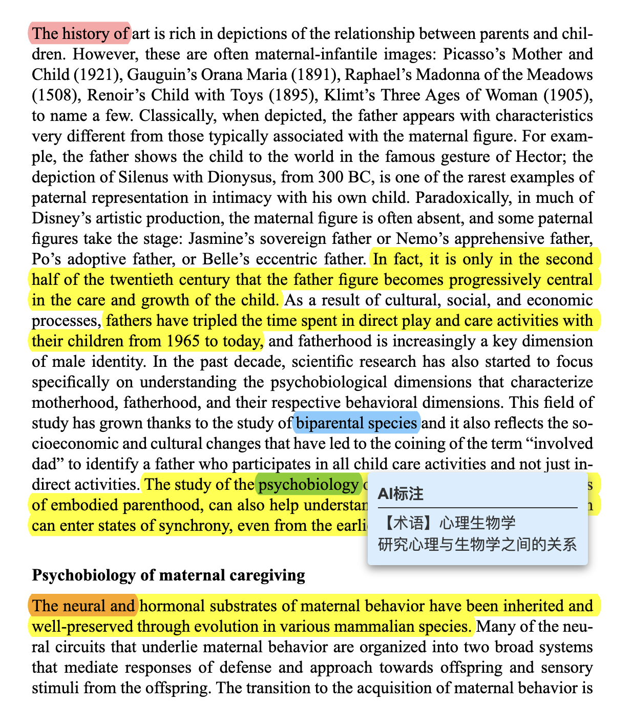

# PDF智能标注工具 

> **一键AI标注，让论文阅读效率提升10倍**  
> 自动识别关键观点、专业术语、段落总结，生成三色标注PDF

<div align="center">
**原始论文** → **AI智能分析** → **标注版论文**

### 🎨 三色高亮系统

| 颜色 | 用途 | 数量 | 效果 |
|------|------|------|------|
| **黄色** | 关键观点 | 20-30个 | 高亮整句，悬停显示30-50字中文注释 |
| **蓝色** | 专业术语 | 不限 | 高亮术语，悬停显示中文翻译+解释 |
| **红色** | 段落总结 | 5-10个 | 标记段首，悬停显示40-80字段落大意 |



**原始论文**：密密麻麻的文字，不知从何下手  
**标注后**：

- **黄色高亮**：20-30个关键观点，快速抓住论文核心
- **蓝色高亮**：所有专业术语，鼠标悬停显示中文翻译
- **红色标记**：5-10个段落总结，理解每段核心内容

##  快速开始（两种方式）

### 方式一：Releases(For Windows)

**界面功能**：

1. 选择PDF文件
2. 配置API密钥（首次使用）
3. 打开"标注设置"自定义配置：
   - 调整高亮颜色
   - 设置关键观点数量（10-50个）
   - 设置段落总结数量（3-20个）
   - 选择术语标注积极程度
4.  点击"开始标注"，实时查看进度
5. 自动生成 `原文件名_annotated.pdf`

### 方式二：命令行 

```bash
# 基本用法
python main.py your_paper.pdf

# 指定输出文件
python main.py input.pdf -o output.pdf

# 使用不同模型
python main.py paper.pdf --model gpt-4o
```

---

##  高级功能：完全可自定义

### 标注设置面板

在GUI中点击" 标注设置"，可以自定义：

#### 数量设置
- **关键观点高亮**：10-50个（默认20-30）
- **段落总结**：3-20个（默认5-10）
- **总结字数**：20-150字（默认40-80）

####  颜色设置
- **关键观点颜色**：可视化颜色选择器
- **术语颜色**：自定义高亮颜色
- **总结标记颜色**：个性化配色

#### 术语标注级别
- **保守**：只标注核心专业术语（oxytocin, amygdala等）
- **适中**（推荐）：专业术语+较难词汇（8+字母）
- **积极**：标注所有可能困难的词汇

### 配置自动保存

所有设置自动保存到 `gui_config.json`，下次启动自动加载。

---

## 🤝 贡献

欢迎贡献代码、报告Bug、提出建议！

```bash
# Fork本项目
# 创建特性分支
git checkout -b feature/AmazingFeature

# 提交更改
git commit -m 'Add some AmazingFeature'

# 推送到分支
git push origin feature/AmazingFeature

# 打开Pull Request
```

---

## 📄 许可证

MIT License - 自由使用、修改、分发

---

## 🙏 致谢

- [PyMuPDF](https://pymupdf.readthedocs.io/) - 强大的PDF处理库
- [OpenAI](https://openai.com/) - 提供AI能力
- [tiktoken](https://github.com/openai/tiktoken) - Token计算工具

---

## 💬 联系方式

- 📧 Email: 2091984032@qq.com
- 🐛 Issues: [GitHub Issues](https://github.com/DqChen77/pdf-annotator/issues)
- 💬 讨论: [GitHub Discussions](https://github.com/DqChen77/pdf-annotator/discussions)

---

<div align="center">

**⭐ 如果这个工具对你有帮助，请给个Star！**

让AI成为你的论文阅读助手 📚🤖✨
